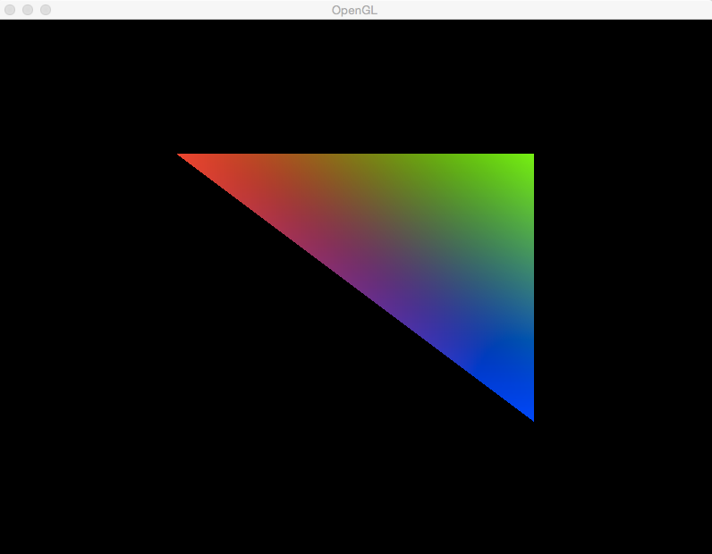

# OpenGL on OS X Yosemite -- Setup Framework
 A framework of setup code for creating an OpenGL project in C++ on OS X Yosemite, using GLFW3 and GLEW.

All code is intended to be fully functional from the command line via the use of Makefiles (no need for XCode or CMake), and incorporates useful third-party libraries such as GLFW3 and GLEW.


#Usage

The demo project uses GLEW and GLFW3 as a means of showing how third-party libraries
can be used with OPENGL in a fairly straightforward way. If you don't have the necessary
libraries installed, zip files for GLEW can be found [here](http://glew.sourceforge.net/) and binaries for GLFW3 can be found [here](http://www.glfw.org/).
(Of course, they can also be removed / substituted).

Once you have the necessary dependencies, that's pretty much it! You may need to tweak the provided Makefile should your libraries be kept in a differently named directories,
but regardless, running ```make``` is intended to generate an OPEN_GL executable that renders the following triangle:




From there, the project is yours. Feel free to extend it and use it
as the framework for any and all OPEN_GL adventures.


# TODO
This project is very much a work in progress. I'll continue to add useful updates and documentation
as I go about building my own OPENGL library. In the meantime, any questions, suggestions, and corrections are highly encouraged!
